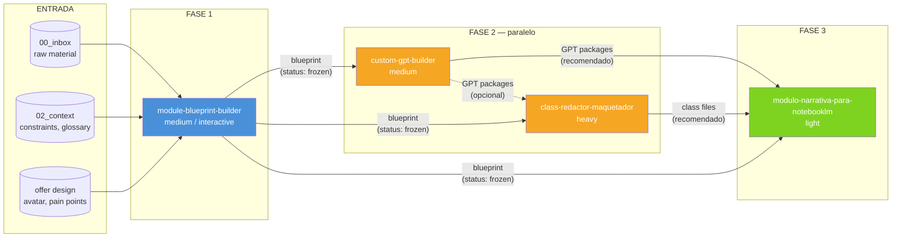
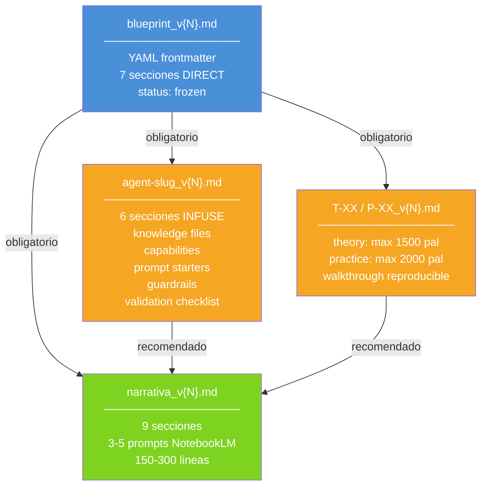
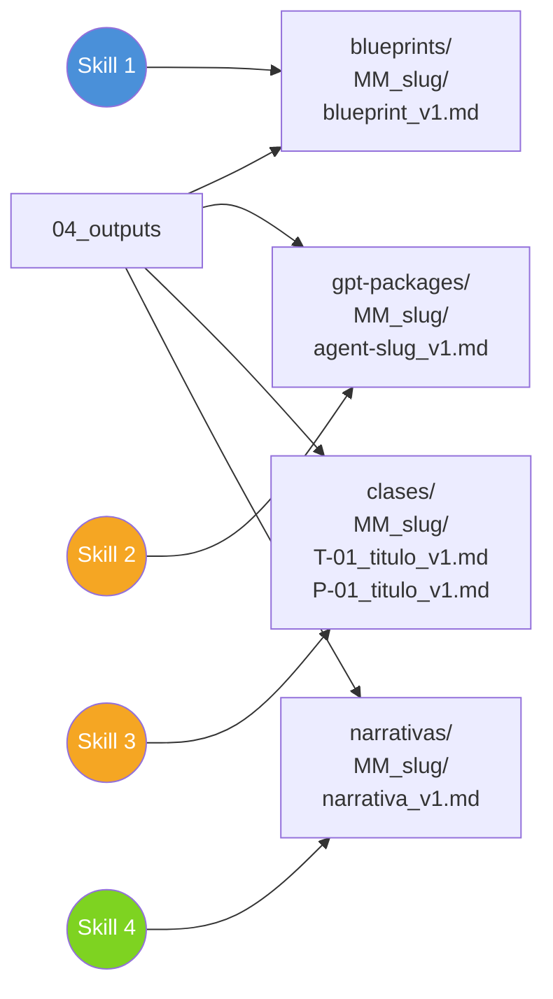
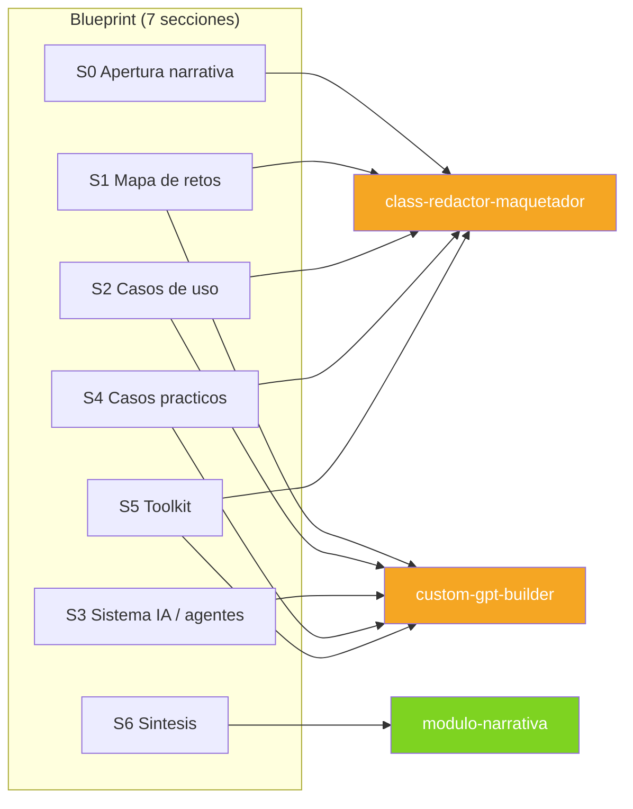
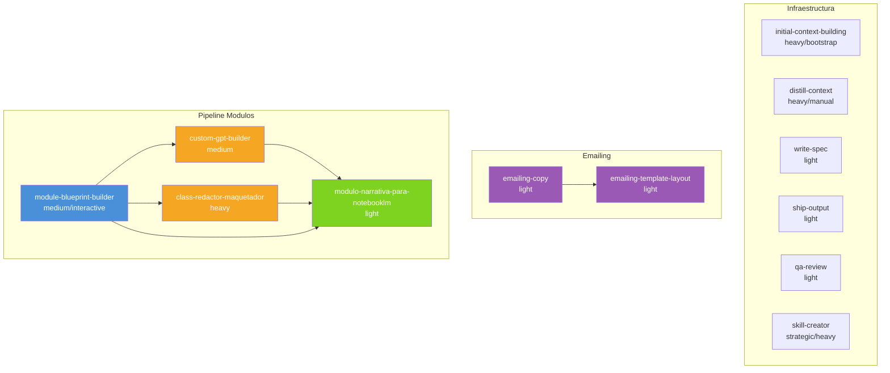
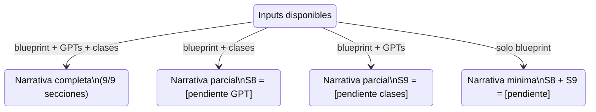

# Pipeline de Produccion de Modulos — Diagramas

> Abrir en cualquier visor Mermaid (GitHub, Obsidian, mermaid.live, VS Code preview).

---

## 1. Pipeline principal

---

## 2. Contrato de datos

---

## 3. Rutas de salida

---

## 4. Routing de secciones del blueprint

---

## 5. Mapa completo de skills del repo (12 skills)

---

## 6. Degradacion graceful (Skill 4)

